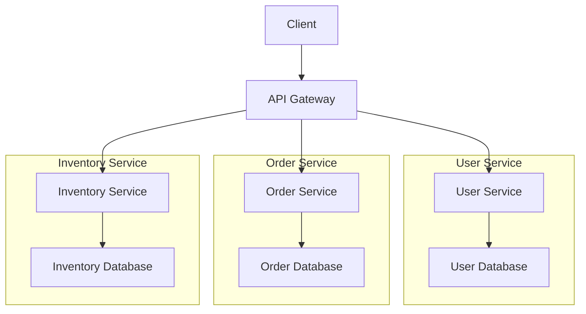

# Architectural Diagram 
## Typical 

```mermaid
graph TD
    A[Client] --> B[API Gateway]
    B --> C[User Service]
    B --> D[Order Service]
    B --> E[Inventory Service]
    C --> F[User Database]
    D --> G[Order Database]
    E --> H[Inventory Database]

    subgraph User Service
        C
        F
    end

    subgraph Order Service
        D
        G
    end

    subgraph Inventory Service
        E
        H
    end
```
